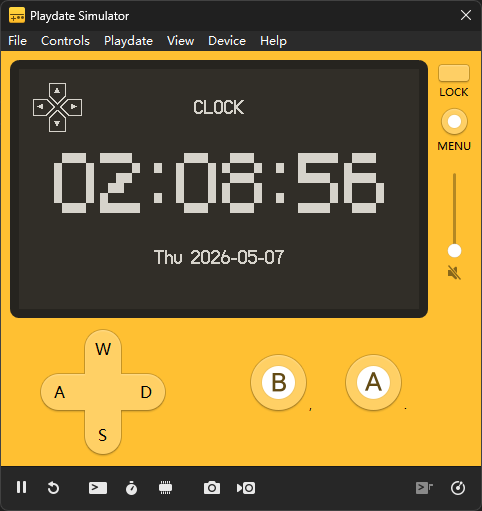
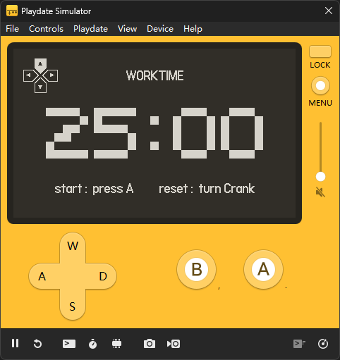
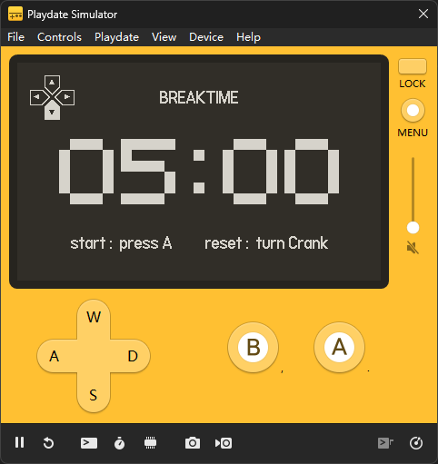
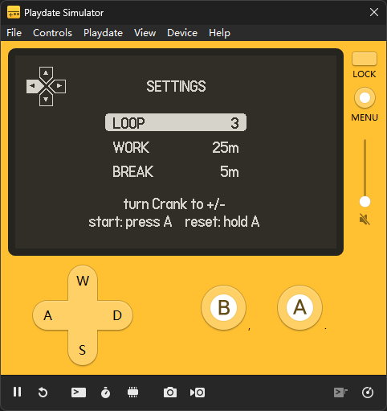
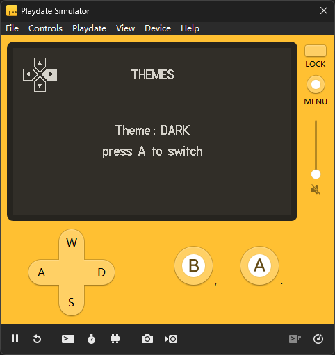
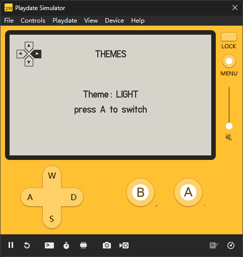
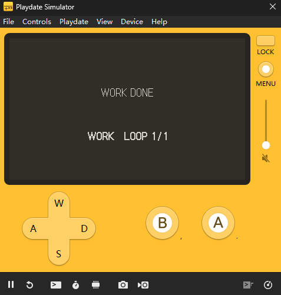

# Pomodoro for Playdate

一个为 Playdate 制作的像素风格的番茄钟小工具，具有专注计时、休息提醒和循环工作管理。

## 功能介绍

- **时钟首页**：默认显示当前时间和日期。

- **工作计时**：提供默认 25 分钟的专注计时。

- **休息计时**：提供默认 5 分钟的休息计时。

- **循环番茄钟**：可按「工作 - 休息」的节奏自动循环，默认循环 3 次。
- **自定义设置**：可以调整循环次数、工作时长和休息时长。

- **主题切换**：支持深色和浅色两种显示主题。

- **完成提醒**：计时结束后会显示阶段完成提示，并播放提示音。

- **Playdate 曲柄交互**：在设置页可用曲柄调整数值，计时页可用曲柄重置当前计时。

## 操作概览

- 方向键切换页面：工作计时、休息计时、设置、主题。
- `A` 键开始计时或切换主题。
- 设置页长按 `A` 键可恢复默认设置。
- 曲柄用于调整设置或重置计时。
